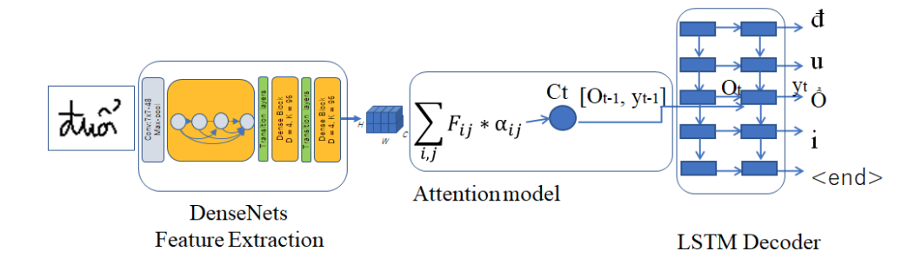

Attention-Based Encoder Decoder for Vietnamese Handwriting Recognition
---

In this repo, we replaced DenseNet with various image recognition models. Paper for the originial structure can be find [here](https://arxiv.org/pdf/1905.05381.pdf)

Link to the UIT-HWDB dataset: [https://github.com/hieunghia-pat/UIT-HWDB-dataset](https://github.com/hieunghia-pat/UIT-HWDB-dataset)
